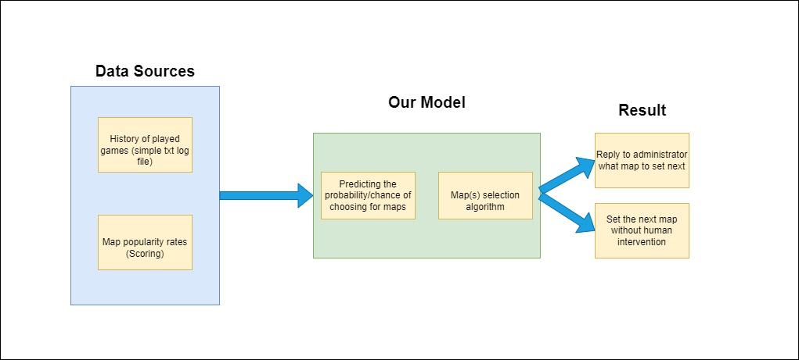

# project_reality_map_admin

About Project Reality: <https://www.realitymod.com/about>

Python versions:
BF2: 2.3.4
Project Reality: 2.7

We will use: 2.7

To use/test your custom scripts in Project Reality

## Model review



### Map change Pattern

1. Tickets < 100
2. Make vote
3. choose maps
4. set map

## How to add you own module

Create a folder (in ```Project Reality BF2\mods\pr\python\game\our_module```), name it whatever you want, create an empty __init__.py inside to make a module that can be used later in the game, and then in ```Project Reality BF2\mods\pr\python\game\__init__.py``` add the following:

```python
 # ------------------------------------------------------------------
 #
 # PROJECT REALITY SERVER INIT
 #
 # This file can be edited by any server (public or private).
 #
 import realityinit

 realityinit.init(False)  # Switch to True if using debugger executables (PRLauncher.exe will automatically modify this value accordingly)

 # ------------------------------------------------------------------
 # Add your custom script's initilization below
 
 '''
 HERE !!!
 '''
 import my_module_name
```

In empty __init__.py (```Project Reality BF2\mods\pr\python\game\our_module\__init__.py```) add the following:

```python
import my_module_name
# initiate it to work
my_module_name.init()
```

## Useful links

<https://web.archive.org/web/20070301124121/http://bf2tech.org/index.php/Learning_Python>\
<https://web.archive.org/web/20061201183739/http://www.bf2tech.org/index.php/Big_Picture>\
<https://web.archive.org/web/20070224121315/http://bf2tech.org/index.php/Event_Reference>\
<https://web.archive.org/web/20070612145128/http://bf2tech.org/index.php/Object_Reference#Event_Handler_Methods>\
<https://www.realitymod.com/forum/showthread.php?t=109751>

## Notes

1. Take an example from the prinfo module import developer modules but do not post them, but you can use them as modules !!!!
2. Start your function with a timer to execute it in the next tick
